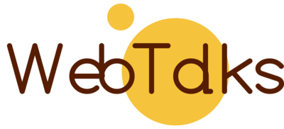

Webtalks is a blog that I created as one of my side projects to master my web development skills. I created it using PHP Laravel Framework, The template used in this website is a bootstrap template which i have customized. Webtalks is a blog where web technology lovers can get up to date news about web technology.

## Tools Used

-   Bootstrap
-   jQuery
-   AlpineJS
-   Ckeditor

## Credits

The template used in this project is taken from [Themefisher](https://themefisher.com/). It is a bootstrap template, which has been customized.

## Contributing

Do not hesitate to contribute to the project by adapting or adding features ! Bug reports or pull requests are welcome.

## Security Vulnerabilities

If you discover a security vulnerability within Webtalks, please send an e-mail to Sakhawat Hussain via [sakhawathussainkaka@gmail.com](mailto:sakhawathussainkaka@gmail.com). All security vulnerabilities will be promptly addressed.
